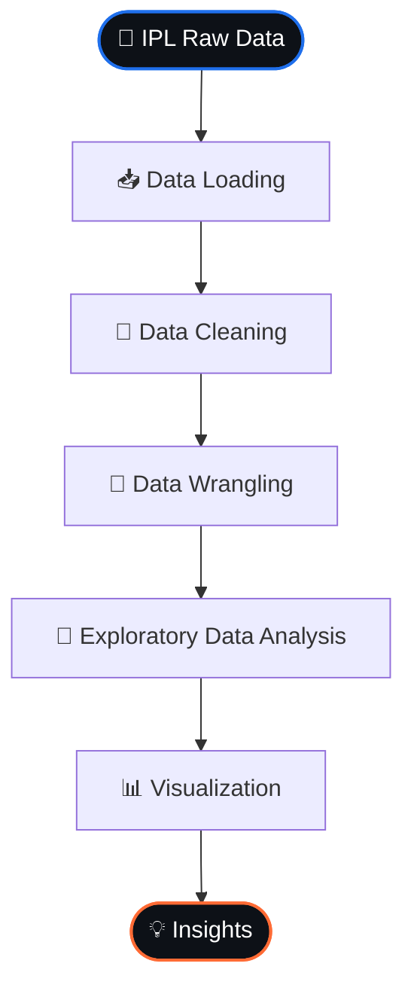
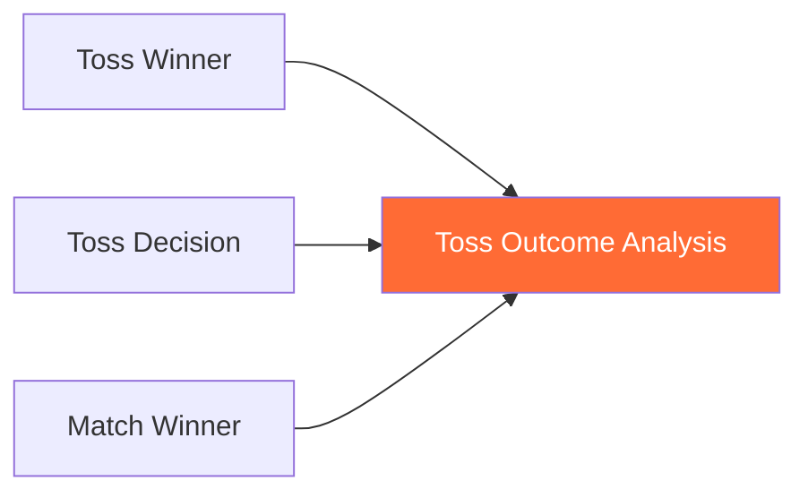
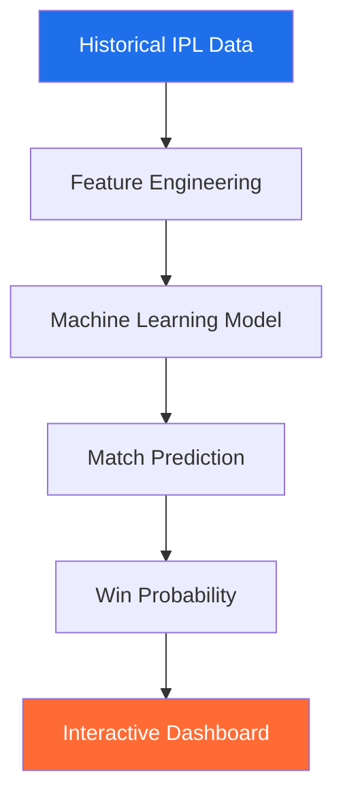

<div align="center">


<br/>


<br/>


<br/><br/>

**Created By:** Harsh Pandey &nbsp;|&nbsp; **Guided By:** Mohit Sir — CETPA Infotech


</div>


## 📌 Table of Contents

<details open>
<summary><b>Click to expand</b></summary>

* [🏏 About the Project](#-about-the-project)
* [🎯 Project Objectives](#-project-objectives)
* [📊 Dataset Overview](#-dataset-overview)
* [🛠️ Technology Stack](#️-technology-stack)
* [📁 Project Structure](#-project-structure)
* [🔍 Data Analysis Workflow](#-data-analysis-workflow)
* [📈 Key Analysis Areas](#-key-analysis-areas)
* [🏆 Team Performance](#-team-performance)
* [👤 Player Performance](#-player-performance)
* [🎖️ Player of the Match Analysis](#️-player-of-the-match-analysis)
* [🏟️ Venue Analysis](#️-venue-analysis)
* [🪙 Toss Analysis](#-toss-analysis)
* [📊 Statistical Analysis](#-statistical-analysis)
* [📉 Data Visualizations](#-data-visualizations)
* [💡 Key Insights](#-key-insights)
* [💻 How to Run the Project](#-how-to-run-the-project)
* [📦 Installation](#-installation)
* [📓 Notebook](#-notebook)
* [📄 Project Report](#-project-report)
* [🚀 Future Enhancements](#-future-enhancements)
* [🎓 Learning Outcomes](#-learning-outcomes)
* [👨‍💻 Author](#-author)

</details>


## 🏏 About the Project

> The **IPL Cricket Data Analytics Project** is a comprehensive exploratory data analysis project focused on understanding patterns, trends, performances, and statistics from the **Indian Premier League**.

The project uses **Python, Pandas, NumPy, Matplotlib, Seaborn, and Jupyter Notebook** to transform raw IPL data into meaningful analytical insights.

<table>
<tr>
<td align="center">🏆<br><b>Team</b><br>Performance</td>
<td align="center">🏏<br><b>Player</b><br>Performance</td>
<td align="center">🎖️<br><b>Player of<br>the Match</b></td>
<td align="center">🪙<br><b>Toss</b><br>Decisions</td>
<td align="center">🏟️<br><b>Venue</b><br>Performance</td>
</tr>
<tr>
<td align="center">📅<br><b>Season-wise</b><br>Trends</td>
<td align="center">🎯<br><b>Match</b><br>Outcomes</td>
<td align="center">📊<br><b>Statistical</b><br>Distributions</td>
<td align="center">🔥<br><b>Winning</b><br>Patterns</td>
<td align="center">📈<br><b>Batting/Bowling</b><br>Trends</td>
</tr>
</table>


## 🎯 Project Objectives

| # | Objective | Description |
|---|-----------|-------------|
| 1️⃣ | **Understand IPL Match Data** | Explore the structure, quality, and characteristics of IPL datasets |
| 2️⃣ | **Analyze Team Performance** | Identify teams with strong historical performance and winning patterns |
| 3️⃣ | **Analyze Player Performance** | Identify important players based on awards and contributions |
| 4️⃣ | **Study Toss Impact** | Analyze whether toss decisions correlate with match outcomes |
| 5️⃣ | **Analyze Venues** | Identify venues with significant match counts and venue-related patterns |
| 6️⃣ | **Discover Historical Trends** | Analyze IPL seasons to identify changes over time |
| 7️⃣ | **Build Data Analytics Skills** | Apply practical, end-to-end analytics skills |


## 📊 Dataset Overview

The project analyzes IPL match-level data covering multiple seasons of the tournament.

| Category | Examples |
|----------|----------|
| 🏏 Matches | Match ID, date, season |
| 🏆 Teams | Team names and competing teams |
| 🏟️ Venue | Stadium / match location |
| 🪙 Toss | Toss winner and toss decision |
| 🥇 Result | Match winner |
| 🎖️ Awards | Player of the Match |
| 📊 Outcome | Win / loss / no-result / tie |
| 👨‍⚖️ Officials | Umpire information |


## 🛠️ Technology Stack

<div align="center">


</div>

| Technology | Purpose |
|------------|---------|
| 🐍 Python | Core programming language |
| 🐼 Pandas | Data manipulation and analysis |
| 🔢 NumPy | Numerical computing |
| 📊 Matplotlib | Data visualization |
| 📈 Seaborn | Statistical visualization |
| 📓 Jupyter Notebook | Interactive analysis |
| 💻 VS Code | Development environment |
| 🐙 GitHub | Version control and project hosting |


## 📁 Project Structure

```text
IPL-CRICKET-DATA-ANALYTICS/
│
├── assets/
│   └── dynamic-bar.gif
│
├── data/
│   ├── matches.csv
│   └── deliveries.csv
│
├── notebooks/
│   └── IPL_Data_Analysis.ipynb
│
├── reports/
│   ├── IPL_Data_Analysis_Report.pdf
│   └── IPL_Data_Analysis_Presentation.pptx
│
├── visualizations/
│   ├── team_performance.png
│   ├── player_performance.png
│   ├── toss_analysis.png
│   └── venue_analysis.png
│
├── requirements.txt
│
└── README.md
```

> **Note:** Update filenames above if your actual repository uses different filenames.


## 🔍 Data Analysis Workflow



### 🧹 Data Cleaning

* Checking dataset dimensions
* Identifying missing values
* Detecting duplicate records
* Checking data types
* Standardizing column names
* Handling inconsistent values
* Converting date columns
* Validating categorical variables
* Preparing data for visualization

```python
import pandas as pd

df = pd.read_csv("matches.csv")

print(df.shape)
print(df.info())
print(df.isnull().sum())
print(df.describe())
```


## 📈 Key Analysis Areas

<details>
<summary>🏆 <b>Team Analysis</b></summary>
<br>

* Which teams have won the most matches?
* Which teams have the strongest historical performance?
* Which teams have appeared most frequently?
* How does team performance change by season?

</details>

<details>
<summary>👤 <b>Player Analysis</b></summary>
<br>

* Which players have received the most Player of the Match awards?
* Which players consistently appear among top performers?
* Which players have had significant historical impact?

</details>

<details>
<summary>🪙 <b>Toss Analysis</b></summary>
<br>

* Which teams have won the most tosses?
* What decision is most common after winning the toss?
* Does winning the toss appear to influence match outcomes?

</details>

<details>
<summary>🏟️ <b>Venue Analysis</b></summary>
<br>

* Which venues hosted the most matches?
* Which venues have the highest match activity?
* How are match outcomes distributed across venues?

</details>

<details>
<summary>📅 <b>Season Analysis</b></summary>
<br>

* How has the IPL changed across seasons?
* Which seasons had the highest number of matches?
* How have teams and venues changed over time?

</details>


## 🏆 Team Performance

Team performance is one of the major components of this project.


```python
team_wins = df["winner"].value_counts()

print(team_wins)
```

This helps identify teams that have historically performed strongly in the IPL.


## 👤 Player Performance

Player-level analysis focuses on identifying influential performers.

**Important metrics include:**

* 🎖️ Player of the Match awards
* 🔢 Number of appearances
* 🏏 Match-winning contributions
* 📅 Season-wise recognition
* 📈 Frequency of awards

```python
player_awards = df["player_of_match"].value_counts()

print(player_awards.head(10))
```


## 🎖️ Player of the Match Analysis

The **Player of the Match** section identifies players who have repeatedly produced match-winning performances.

> 🏏 *Who has received the most Player of the Match awards?*

```python
top_players = (
    df["player_of_match"]
    .value_counts()
    .head(10)
)

print(top_players)
```


## 🏟️ Venue Analysis

Venue analysis examines IPL activity across different stadiums.

**Key questions include:**

* Which venues hosted the most matches?
* Which locations have been major IPL centers?
* How has venue usage changed over time?

```python
venue_matches = df["venue"].value_counts().head(10)

print(venue_matches)
```


## 🪙 Toss Analysis

The project investigates the relationship between the toss and match outcomes.



```python
toss_wins = df["toss_winner"].value_counts()

print(toss_wins)
```

The project can further compare:

```python
toss_match_winner = (
    df["toss_winner"] == df["winner"]
)

print(toss_match_winner.mean() * 100)
```

This helps estimate how frequently the toss-winning team also won the match.


## 📊 Statistical Analysis

**Important techniques include:**

* 📈 Frequency analysis
* 🗂️ GroupBy analysis
* ➕ Aggregation
* 📐 Percentage calculations
* 📊 Distribution analysis
* ⚖️ Comparative analysis
* 📉 Trend analysis
* 🔗 Correlation where applicable

```python
df.groupby("season")["id"].count()
```


## 📉 Data Visualizations

<table>
<tr>
<th>Chart Type</th>
<th>Used For</th>
</tr>
<tr>
<td>📊 <b>Bar Charts</b></td>
<td>Team wins, player awards, venue matches, season statistics</td>
</tr>
<tr>
<td>🥧 <b>Pie Charts</b></td>
<td>Toss decisions, match-result distributions, categorical comparisons</td>
</tr>
<tr>
<td>📈 <b>Line Charts</b></td>
<td>Season-wise trends, historical performance, match counts over time</td>
</tr>
<tr>
<td>🔥 <b>Heatmaps</b></td>
<td>Relationships between categorical or numerical variables</td>
</tr>
<tr>
<td>📦 <b>Distribution Plots</b></td>
<td>Understanding statistical distributions</td>
</tr>
</table>

### 🖼️ Visualization Gallery

> Replace the image filenames below with the exact filenames in your repository.

<p align="center">
  
  
</p>

<p align="center">
  
  
</p>


## 💡 Key Insights

<table>
<tr>
<td valign="top" width="20%">

**🏆 Team**
- Historical differences in performance
- Strong-performing franchises
- Season-wise dominance shifts

</td>
<td valign="top" width="20%">

**👤 Player**
- Repeated PoM recognition
- Consistently influential players
- Historical performance patterns

</td>
<td valign="top" width="20%">

**🪙 Toss**
- Most common toss decisions
- Toss winner vs match winner link
- Strategy shifts across seasons

</td>
<td valign="top" width="20%">

**🏟️ Venue**
- Most frequently used venues
- Major IPL cricket centers
- Venue distribution by season

</td>
<td valign="top" width="20%">

**📅 Season**
- Tournament growth & evolution
- Variation in match counts
- Team & venue changes

</td>
</tr>
</table>


## 🧠 Analytical Questions

This project can answer questions such as:

1. Which team has won the most IPL matches?
2. Which player has received the most Player of the Match awards?
3. Which venues have hosted the most matches?
4. Which team has won the most tosses?
5. What is the most common toss decision?
6. How often does the toss winner also win the match?
7. Which IPL seasons had the most matches?
8. How has team performance changed over time?
9. Which players consistently appear among top performers?
10. What major trends can be identified from IPL historical data?


## 💻 How to Run the Project

**Step 1 — Clone the Repository**
```bash
git clone https://github.com/YOUR-USERNAME/YOUR-REPOSITORY.git
```

**Step 2 — Enter the Project**
```bash
cd IPL-CRICKET-DATA-ANALYTICS
```

**Step 3 — Install Dependencies**
```bash
pip install -r requirements.txt
```

**Step 4 — Launch Jupyter Notebook**
```bash
jupyter notebook
```

**Step 5 — Open the Analysis Notebook**
```text
notebooks/IPL_Data_Analysis.ipynb
```

Run the notebook cells sequentially. ✅


## 📦 Installation

```bash
pip install pandas numpy matplotlib seaborn jupyter
```

Or install everything from:

```bash
pip install -r requirements.txt
```


## 📓 Notebook

The complete exploratory analysis is available in the Jupyter Notebook:

```text
IPL_Data_Analysis.ipynb
```


## 📄 Project Report

A detailed project report is included with the repository, documenting:

* Project objectives
* Dataset description
* Data preparation
* Exploratory analysis
* Visualizations
* Major findings
* Conclusions

## 🎤 Project Presentation

**Recommended presentation structure:**

```text
1. Introduction              8. Player Analysis
2. Problem Statement         9. Toss Analysis
3. Dataset                  10. Venue Analysis
4. Technology Stack         11. Visualizations
5. Data Cleaning            12. Key Insights
6. Exploratory Data         13. Conclusion
   Analysis                 14. Future Scope
7. Team Analysis
```


## 🚀 Future Enhancements

<table>
<tr>
<td>📊 Interactive Power BI dashboard</td>
<td>🖥️ Interactive Streamlit dashboard</td>
</tr>
<tr>
<td>🏏 Player performance prediction</td>
<td>🎯 Match winner prediction</td>
</tr>
<tr>
<td>📈 Win-probability model</td>
<td>🤝 Player recommendation system</td>
</tr>
<tr>
<td>⚖️ Team comparison dashboard</td>
<td>📅 Season comparison dashboard</td>
</tr>
<tr>
<td>🧮 Advanced statistical modeling</td>
<td>🤖 Machine Learning integration</td>
</tr>
<tr>
<td>🗄️ SQL-based IPL analytics</td>
<td>⚙️ Automated data pipeline</td>
</tr>
<tr>
<td colspan="2" align="center">📡 Live IPL data integration</td>
</tr>
</table>




## 🎓 Learning Outcomes

<table>
<tr>
<td valign="top">

**🐍 Python**
- Variables
- Functions
- Data structures
- Conditional logic
- Data processing

</td>
<td valign="top">

**🐼 Pandas**
- DataFrame manipulation
- Filtering
- GroupBy
- Aggregation
- Missing-value handling
- Data transformation

</td>
<td valign="top">

**🔢 NumPy**
- Numerical operations
- Arrays
- Statistical calculations

</td>
<td valign="top">

**📈 Visualization**
- Matplotlib
- Seaborn
- Statistical charts
- Comparative viz
- Trend analysis

</td>
<td valign="top">

**📊 Analytics**
- EDA
- Data cleaning
- Pattern identification
- KPI analysis
- Insight generation
- Data storytelling

</td>
</tr>
</table>


## 🏁 Conclusion

The **IPL Cricket Data Analytics Project** demonstrates how Python-based data analytics can be applied to real-world sports data.

By combining data cleaning, exploratory analysis, statistical techniques, and visualization, the project transforms raw IPL match information into meaningful insights about:

🏆 Teams &nbsp;•&nbsp; 👤 Players &nbsp;•&nbsp; 🎖️ Player of the Match Awards &nbsp;•&nbsp; 🪙 Toss Decisions &nbsp;•&nbsp; 🏟️ Venues &nbsp;•&nbsp; 📅 Seasons &nbsp;•&nbsp; 📊 Match Outcomes

The project also provides a strong foundation for future development into **Power BI dashboards, Streamlit applications, SQL analytics, and Machine Learning prediction systems**.


## 👨‍💻 Author

<div align="center">

### Harsh Pandey

**Data Analytics | Python | SQL | Data Visualization**

*Created as a practical Data Analytics project*

<br/>

## ⭐ Support the Project

If you find this project useful:

⭐ Star the repository &nbsp;|&nbsp; 🍴 Fork the repository &nbsp;|&nbsp; 📢 Share the project &nbsp;|&nbsp; 💡 Suggest improvements

<br/>


</div>
